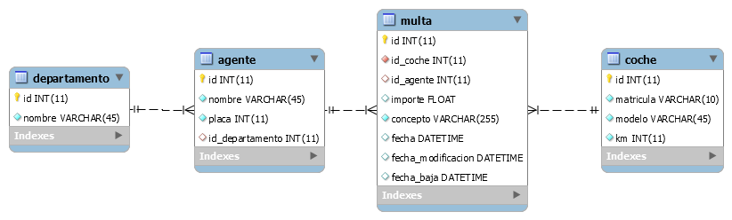
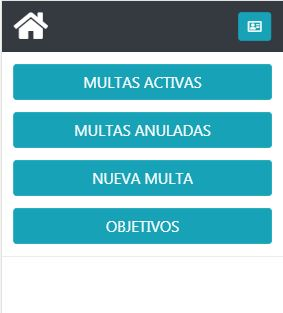
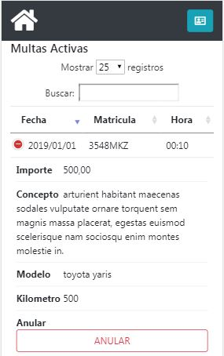
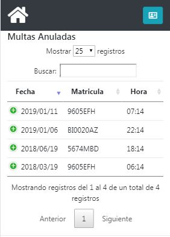
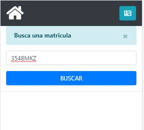
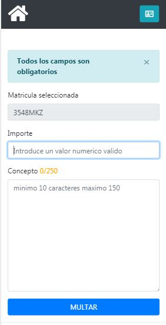
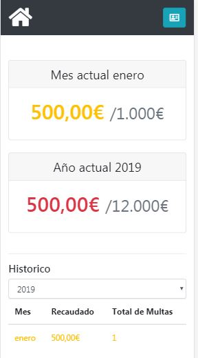

=========================
MULTOMETRO
=========================

Aplicación web para moviles , que registra multas.

TECNOLOGIAS
----------------
J2EE 1.8 
MySQL InnoDBJ2EE 1.8 
Proyecto mavenizado 3.1
Uso de JSLT expression language.
Maquetado con BOOTSTRAP.

Apendice Base de Datos
***************************
Multapp trabaja con Bases de Datos diseñadas en MySQL InnoBD con el fin de asegurar la integridad de los registros.

dgt.sql: Se encuentra en la carpeta SQL en la rama del proyecto. Contiene el script que genera la base de datos y su contenido.

database.properties: archivo con los datos necesarios para la conexion con la BBDD. Están hubicados en la carpeta resources del proyecto.

Instalar la base de datos adjunta, carpeta SQL, o puedes acceder mediante el siguiente enlace:
https://github.com/imaheripr/dgt/blob/master/SQL/copiaDBdgt.sql

DIAGRAMA ENTIDAD-RELACION
----------------

    
UX
----------------

Al registrarse el agente entra en la pagina de bienvenida.
Si seleccciona listar multas, el agente puede ver todas las multas que ha registrao
y el detalle de cada  multa.
Si seleccciona multar, pasa a otra pantalla con un buscador para matriculas validado  
Despues pasa a una pantalla dond debe introducir el importe de la multa y el concepto.
Multa registrada con exito

    Desarrolladores
App desarollada por Imanol y David
    
    
